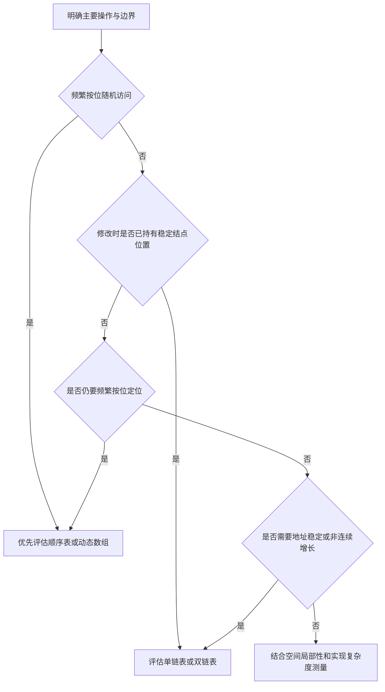

> [!abstract] 本页速览
> **本页解决的问题**：
> - 面对同一个线性表接口，怎样根据访问、修改、容量和内存环境选择顺序表或链表。
> - 为什么“链表插入为常数时间”“顺序表浪费空间”等说法都必须附带条件。
>
> **知识位置**：
> - 本页综合 [1.2 顺序表](/tutorials/data-structures/02-linear-lists/02-array-list)、[1.3 单链表](/tutorials/data-structures/02-linear-lists/03-linked-list) 和 [1.4 链表变体](/tutorials/data-structures/02-linear-lists/04-list-variants)，把实现细节转化为可复用的选型方法。
>
> **前置知识**：
> - [1.2 顺序表](/tutorials/data-structures/02-linear-lists/02-array-list)：连续存储、元素移动和动态扩容。
> - [1.3 单链表](/tutorials/data-structures/02-linear-lists/03-linked-list)：前驱定位、链接修改和资源释放。
>
> **学完后应能解释**：
> - 定位成本与局部修改成本为什么要分开计算。
> - 存储开销、定位条件和插入删除代价如何影响选择。
> - 给定具体操作比例和边界要求时，如何做出有依据的判断。

---

## § 1.5.1 比较的是实现，不是抽象接口

顺序表和链表都能实现 List ADT，因此它们对合法操作给出相同的逻辑结果。真正不同的是：

- 元素和相邻关系怎样编码到内存中。
- 找到目标位置需要多少工作。
- 找到之后完成修改需要多少工作。
- 容量变化、内存分配和缓存访问如何发生。

选择结构时不能只看一个孤立的复杂度口号。应把一次完整操作拆成：

1. **定位阶段**：怎样得到目标元素、前驱或插入点。
2. **修改阶段**：移动多少元素或修改多少链接。
3. **资源阶段**：是否扩容、分配、释放或维护额外索引。

## § 1.5.2 存储布局与空间成本

- **先比较地址组织**：
  - 蓝色区域中的顺序表把 `A`、`B`、`C` 放在连续地址中，下标可以换算为相对首地址的固定偏移。
  - 紫色区域中的单链表把结点放在离散地址中，逻辑相邻关系由 `next` 箭头维持。
- **再跟随两条插入路径**：
  - 顺序表在 **0-based 下标 `1`**（即 **1-based 位序 `2`**）插入 `X` 时，箭头表示先从后向前搬移 `C`、`B`，再写入空出的槽位。
  - 单链表已知 `A` 后插入 `X` 时，只改写 `X.next` 与 `A.next`；若尚未持有 `A`，定位成本仍需另算。
- **区分访问代价的来源**：
  - 连续布局通过地址计算直接读取第 $i$ 个元素；链式布局必须沿 `next` 逐结点前进。
- **最后读取绿色选择框**：
  - 图中的结论建立在元素等长、顺序表连续存储、链表结点合法且链接完整的前提下；具体选择还要结合扩容、指针开销和真实工作负载。

### 一、顺序表

- 有效元素连续存放，元素本体之间没有链接字段。
- 静态表会一次预留固定容量；未使用槽位属于预留空间。
- 动态表只在需要时扩容，但通常保留一部分未使用容量，以减少频繁搬迁。
- 扩容要求得到一段足够大的连续区域，并可能使所有内部元素地址失效。

### 二、链表

- 每个结点单独分配，不要求所有结点整体连续。
- 每个结点除数据外还保存一个或多个链接字段。
- 分配器可能为对齐和管理元数据增加额外成本，不能只把字段字节数机械相加。
- 删除结点可立即归还该结点空间，但频繁的小对象分配也可能带来碎片和管理开销。

- 若把单个结点中有效数据字节数记为 $D$，结点实际占用字节数记为 $N$，则存储密度可写作 $\rho=D/N$。
	- 顺序表元素区中通常有 $\rho=1$；链表结点因链接和填充有 $\rho<1$。
	- 这个比例只描述元素区，不包含容器对象、动态数组空余容量或内存分配器元数据。

> [!example] 示例：不要忽略结构体填充
> 假设某 ABI 中 `int` 为 4 字节、指针为 8 字节且指针按 8 字节对齐：
> - 单链表结点的字段表面上是 `4 + 8 = 12` 字节，但结构体常需要补齐到 16 字节。
> - 双链表结点的字段表面上是 `4 + 8 + 8 = 20` 字节，常补齐到 24 字节。
> - 这些只是特定 ABI 下的示例；C 标准不保证上述具体数值，真实大小应使用 `sizeof` 验证。

## § 1.5.3 访问、查找与修改

| 完整操作 | 顺序表 | 单链表 | 必要条件 |
| --- | --- | --- | --- |
| 按位读取 | $\Theta(1)$ | 最坏 $\Theta(n)$ | 顺序表可计算地址；链表要沿链接前进 |
| 无序表按值查找 | 最坏 $\Theta(n)$ | 最坏 $\Theta(n)$ | 都可能检查全部元素 |
| 有序表按值查找 | 可用折半查找 $\Theta(\log n)$ | 通常仍为 $\Theta(n)$ | 折半查找还依赖随机访问 |
| 已知位序后插入 | 最坏 $\Theta(n)$ | 最坏 $\Theta(n)$ | 链表仍要先定位前驱 |
| 已持有正确前驱后插入 | 仍可能 $\Theta(n)$ | $\Theta(1)$ | 顺序表移动后缀；链表改常数个链接 |
| 已知位序后删除 | 最坏 $\Theta(n)$ | 最坏 $\Theta(n)$ | 两者都包含定位或移动 |
| 已持有目标结点后删除 | 不适用为稳定接口 | 单链表还可能需要前驱 | 双链表已知目标时可 $\Theta(1)$ |
| 尾部追加 | 容量足够时 $\Theta(1)$ | 有尾指针时 $\Theta(1)$ | 动态数组偶发扩容；无尾指针链表需遍历 |

> [!warning] “已知位置”的含义必须具体
> - “知道第 500 位”只是知道逻辑位序，单链表仍需遍历。
> - “持有第 499 个结点的有效指针”才是已知单链表插入前驱。
> - 对删除而言，单链表通常需要目标前驱；双链表可从目标的 `prior` 得到前驱。

> [!info]- 扩展了解：局部性、地址稳定性与动态数组
> 顺序表和链表的存储、访问与插删代价属于主线；缓存局部性、迭代器失效和几何扩容用于进一步理解工程表现。
>
> ## § 1.5.4 空间局部性与地址稳定性
>
> ### 一、空间局部性
>
> - 顺序表的相邻元素也位于相邻地址。
> 	- 顺序遍历时，一次缓存行装入往往能提供多个后续元素，硬件预取也更容易识别访问模式。
>
> - 链表的结点可能分散在堆中。
> 	- 每一步都要先读取 `next` 才知道下一个地址，处理器较难提前发起后续访问。
> 	- 因此，即使两种结构的顺序遍历都为 $\Theta(n)$，真实时间仍可能显著不同。
>
> - 这里不能给出脱离机器、结点大小和分配方式的固定倍数。
> 	- 复杂度描述增长趋势；真实性能需要在实际平台和数据上测量。
>
> ### 二、地址与迭代器稳定性
>
> - 动态顺序表扩容后，指向旧元素区域的指针、引用或迭代器通常失效。
> - 顺序表中间插入或删除会移动后缀，因此指向被移动元素的位置标识也可能失效。
> - 链表插入新结点通常不会移动其他结点，未删除结点的地址更稳定。
> - 链表删除后，被删结点指针立即失效；继续使用会形成悬空指针。
>
> 若外部代码长期保存元素地址，稳定性本身可能比某个渐进复杂度更重要。
>
> ## § 1.5.5 动态数组是怎样的折中
>
> 动态数组保留连续布局，并把“容量固定”改为运行时扩容：
>
> - 按位读取仍为 $\Theta(1)$。
> - 容量足够时，尾部追加为 $\Theta(1)$。
> - 几何扩容下，连续追加的均摊时间为 $O(1)$。
> - 某一次扩容仍需复制或移动全部元素，单次最坏为 $\Theta(n)$。
> - 中间插入和删除仍要移动后缀，动态容量没有消除这一成本。
>
> - 因此，动态数组并不是“既有顺序表全部优点，又有链表全部优点”。
> 	- 它解决的是容量增长问题，没有改变连续存储的核心不变量。
>

## § 1.5.6 按工作负载做选择

- 读图时不要把分支当作绝对结论。
	- 它先筛出最有影响的操作，再用容量、地址稳定性、局部性和实现成本完成判断。

### 一、顺序表通常更合适的条件

- 频繁按位访问或折半查找。
- 主要操作是顺序遍历、尾部追加，少做中间插删。
- 元素较小，链接字段占比会很高。
- 需要较好的缓存局部性。
- 容量上界已知，或可以接受动态扩容的偶发搬迁。

### 二、链表可能更合适的条件

- 修改点由迭代器、结点指针或其他索引直接提供，而不是每次从位序重新寻找。
- 需要频繁在已知位置局部插删，且不希望移动其他元素。
- 元素数量变化大，难以一次获得足够连续空间。
- 未删除结点的地址需要保持稳定。
- 可以接受每结点链接字段、分配器开销和较弱局部性。

## § 1.5.7 完整可复算示例

> [!example] 示例：两种不同的任务序列
> **任务 A：测量值缓存**
> - 初始为空，连续追加 $1\,000\,000$ 个定长数值。
> - 之后频繁读取任意下标，几乎不在中间删除。
> - 动态顺序表可均摊常数时间追加、常数时间按位读取，并利用连续布局。
> - 单链表每次按位读取最坏要走完整条链，且每个数值额外携带指针，不合适。
>
> **任务 B：编辑器内部的已定位片段链**
> - 上层结构始终持有待修改片段结点的有效迭代器。
> - 操作主要是在这些已定位结点前后插入或删除大型片段对象。
> - 链表局部改链为常数次，其他结点不移动，地址也较稳定。
> - 若上层只给字符位序而没有额外索引，链表定位又会变为线性时间，此时结论需要重新评估。
>
> **合理性检查**：两个选择都来自“完整工作负载 + 前置条件”，不是来自“读多或写多”这一句过度简化的口号。

## § 1.5.8 边界与失败路径

- 顺序表需要连续空间；即使总空闲内存足够，也可能无法获得所需的单块区域。
- 链表也会分配失败，不能把“按需增长”写成“永远不会溢出”。
- 动态数组扩容失败时必须保留旧区域和原状态。
- 链表频繁分配、释放后可能产生碎片；对象池或静态链表是可能的替代，但会引入容量管理。
- 链表若没有保存表长，求长度需遍历；顺序表和链表的元数据设计也会改变某些操作代价。
- 小规模数据中，常数因子可能主导；渐进结论不能替代基准测量。
- 若需要范围查询、按关键字快速查找或并发更新，线性表的两种基本实现都可能不是最终选择。

> [!question]- 理解检查
> 1. 为什么“链表插入为 $\Theta(1)$”需要说明已持有前驱？
> 2. 有序顺序表与有序链表都保持关键字次序，为什么折半查找更适合前者？
> 3. 动态数组解决了顺序表的哪个限制，又保留了哪个限制？
>
> **参考回答**：
> 1. 局部改链是常数次，但从逻辑位序寻找前驱最坏为线性时间。
> 2. 折半查找每轮要直接访问中点；顺序表能计算地址，链表定位中点仍需沿链接前进。
> 3. 它允许容量在运行时增长；但扩容仍需连续空间和整体搬迁，中间插删仍需移动后缀。

## 总结

- 选型必须计算完整操作：顺序表的定位通常快但中间修改要移动后缀；链表的局部改链快，但只给位序时仍要先遍历定位。
- 顺序表用连续存储换取随机访问，但插入删除通常要移动元素；链表用指针表达次序，按位访问需逐结点查找，已知前驱后的局部改链才是常数时间。
- 缓存局部性、地址稳定性和动态数组扩容属于进一步理解实现选择的内容，已放入折叠扩展。

← [1.4 链表变体](/tutorials/data-structures/02-linear-lists/04-list-variants) | [00-数据结构](/tutorials) | 2.1 栈 →
