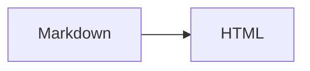

本文是格式展示用的示例，不代表真实经历或正式教程。博客与教程使用相同的正文，方便对照渲染。

## 标题与文字

普通中文与 English text，**粗体**、*斜体*、~~删除线~~，以及行内代码 `npm run build`。

### 三级标题

#### 四级标题

##### 五级标题

###### 六级标题

[返回首页](/) · [博客示例](/blog/format-demo) · [教程示例](/tutorials/format-demo) · [跳到表格](#表格)

## 列表与引用

- 无序列表第一项
- 无序列表第二项
  - 嵌套子项，检查缩进

1. 准备 Markdown
2. 打开文章页面
3. 对照每一项展示

- [x] 已完成项目
- [ ] 待完成项目

> 普通引用：观察文字、边框与背景。
>
> 第二段引用。
> > 嵌套引用。

## 表格

| 格式 | 示例 | 预期 |
| :--- | :---: | ---: |
| 行内代码 | `const n = 1` | 1 |
| 强调 | **粗体** | 2 |
| 中文与英文 | Markdown | 3 |

## 代码块

```ts title="hello.ts"
interface Person {
  name: string
}
const greet = (person: Person) => {
  return `Hello, ${person.name}!`
}
console.log(greet({ name: 'Markdown' })) // [!code highlight]
```

```diff
- const enabled = false
+ const enabled = true
```

```text
没有高亮的纯文本。
长行测试：https://example.com/a/very/long/path/that/should/scroll/inside/the/code/block/without/expanding/the/page
```

## 数学公式

行内公式：$E = mc^2$，以及 $O(n \log n)$。

$$
\sum_{i=1}^{n} i = \frac{n(n+1)}{2}
$$

## 图片


*图片说明：检查宽度、居中与替代文字。*

## 脚注与分隔线

这句话带有脚注[^demo]。

[^demo]: 脚注内容，检查编号、跳转和返回链接。

---

## 折叠内容与 HTML

<details>
<summary>点击展开补充说明</summary>
<p>这是一段原生 HTML 折叠内容，检查点击展开与收起。</p>
</details>

<kbd>⌘</kbd> + <kbd>K</kbd>，<mark>高亮文字</mark>，H<sub>2</sub>O，x<sup>2</sup>。

## 扩展语法边界

以下展示 Mermaid 流程图和引用扩展语法，方便检查当前阅读器的渲染。



> [!NOTE]
> 普通 Markdown 引用，不承诺专用提示框样式。
